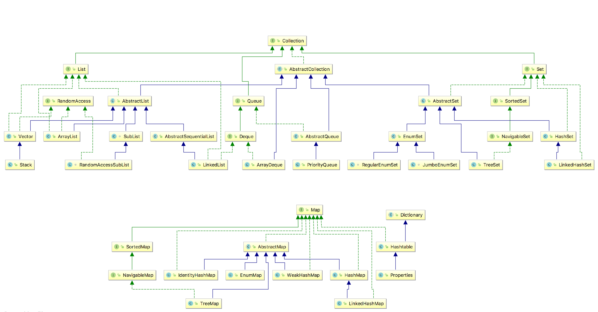

# 给出场景，问数据结构？

下面是我们经常使用的集合类

List

* ArrayList
* Vector
* Stack
* LinkedList

Set

* HashSet
* TreeSet

Map

* HashMap
* TreeMap
* WeakHashMap
* LinkedHashMap
* IdentityHashMap

对于查找和删除较为频繁，且元素数量较多的应用，Set或Map是更好的选择；

ArrayList适用于通过为位置来读取元素的场景；

LinkedList 适用于要头尾操作或插入指定位置的场景；

Vector 适用于要线程安全的ArrayList的场景；

Stack 适用于线程安全的LIFO场景；

HashSet 适用于对排序没有要求的非重复元素的存放；

TreeSet 适用于要排序的非重复元素的存放；

HashMap 适用于大部分key-value的存取场景；

TreeMap 适用于需排序存放的key-value场景。

