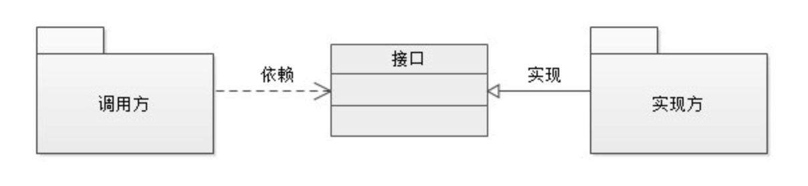

# 理解SPI

## 概念

SPI，Service Provider Interface，即服务提供者接口，是Java 6提供的新特性：对于给定接口，发现和加载该接口的实现类。

在面向对象的编程中，我们推荐面向接口编程。假如在项目A中有接口`EchoService`，它有两个实现类`SimpleEchoServiceImpl`和`PrettyEchoServiceImpl`，在项目B中，我们需要调用`EchoService`，并选择其实现`SimpleEchoServiceImpl`，则项目B中需要依赖项目A的jar文件，并编写代码如下：

```text
EchoService echoService = new SimpleEchoServiceImpl();
```

如果后期在项目B中，需要使用实现`PrettyEchoServiceImpl`，则需要修改代码为：

```text
EchoService echoService = new PrettyEchoServiceImpl();
```

这样硬编码的方式，违反了可插拔的原则。

SPI就是为解决这种问题而生的。

现在，我们使用SPI的方式去解决上述问题，需要遵循以下步骤：

①在项目B中的`resource`目录下新建目录`META/service`，并在该目录中新建名为`com.xxx.yyy.EchoService`的文件，并在该文件中写上如下内容：

```text
com.xxx.yyy.impl.PrettyEchoServiceImpl
```

②在项目B中，使用SPI提供的`ServiceLoader`工具类加载实现类，代码如下：

```java
ServiceLoader<EchoService> s = ServiceLoader.load(EchoService.class);
Iterator<EchoService> iterator = s.iterator();
while (iterator.hasNext()) {
    EchoService echoService =  iterator.next();
    echoService.methodXxxx();
}
```

## SPI应用方式

通过上面的介绍和示例，我们了解了SPI的核心概念和一般使用流程。在实际场景中，SPI的使用方式或者项目组织方式并非总是如此。



### 方式1

上面的示例中，接口与实现方是在同一项目中，最终会打包为一个jar文件。而调用方则会依赖这个jar文件，并在自己的代码结构中添加指定实现类的目录和文件，最后使用ServiceLoader去加载实现类。

### 方式2

对于接口与实现方是在同一项目中的情况，通常会按照接口/实现1/实现2/...这种方式将整个项目划分为多个子模块（一个模块会打包为一个jar文件），在具体的实现者模块的代码结构中，新建`META/service`目录，并在该目录中新建名为`com.xxx.yyy.ZzzService`的配置文件，并在该文件中写明自己实现类全限定名。最后，调用方或使用方依赖接口模块的jar，并根据自己的需求，选择依赖一个或多个实现模块的jar，再通过`ServiceLoader`工具类加载实现类。

### 方式3

更为常见的应用方式是：接口和实现方分别是不同的项目。这是Java提供SPI机制的经典应用方式。

比如，JDBC中不同数据库驱动的加载，之前我们往往会通过如下方式去获取（假如获取MySQL的驱动）：

```java
Class.forName("com.mysql.Driver")
```

对于不同的数据库，如MySQL/Oracel/PostgreSQL，它们的驱动器肯定是不同的，甚至对同一种数据库，也可能会有多种驱动实现。如果使用上面硬编码的方式，很显然是不妥的。

看看使用SPI机制是如何解决上述问题的：Java提供了`java.sql.Driver`接口，不同的数据库厂商需要在自己的驱动实现中，按照Java SPI规范，在驱动包中，新建`META/service`目录，在其中新建一个名为`java.sql.Driver`的配置文件，并在该配置文件中指明自己的实现类。如`mysql-connector-java.jar`：


此后，通过Java提供的DriverManager进行加载：

```java
public class DriverManager {
    ... ... 
    static {
        loadInitialDrivers();
        println("JDBC DriverManager initialized");
    }
    ... ...
    private static void loadInitialDrivers() {
        ... ... 
        ServiceLoader<Driver> loadedDrivers = ServiceLoader.load(Driver.class);
        Iterator<Driver> driversIterator = loadedDrivers.iterator();
        try{
            while(driversIterator.hasNext()) {
                driversIterator.next();
            }
        } catch(Throwable t) {
            // Do nothing
        }  
        ... ...   
    }
}
```

注意：Oracel并没有遵循该规范，所有还是要使用`Class.forName`的方式去加载驱动。

### 方式4

接口与调用方在同一项目中，不同实现者为不同的项目。这种方式下，需要在调用方和接口所在的项目中，根据需要去选择依赖实现者，再借助ServiceLoader去加载实现者。

在Java中，除了Driver这个大家比较熟悉的接口，还要很多SPI接口（但很少有实现方去遵循）：

* [_CurrencyNameProvider:_](https://docs.oracle.com/javase/8/docs/api/java/util/spi/CurrencyNameProvider.html) provides localized currency symbols for the _Currency_ class.
* [_LocaleNameProvider_](https://docs.oracle.com/javase/8/docs/api/java/util/spi/LocaleNameProvider.html)_:_ provides localized names for the _Locale_ class.
* [_TimeZoneNameProvider:_](https://docs.oracle.com/javase/8/docs/api/java/util/spi/TimeZoneNameProvider.html) provides localized time zone names for the _TimeZone_ class.
* [_DateFormatProvider_](https://docs.oracle.com/javase/8/docs/api/java/text/spi/DateFormatProvider.html)_:_ provides date and time formats for a specified locale.
* [_NumberFormatProvider_](https://docs.oracle.com/javase/8/docs/api/java/text/spi/NumberFormatProvider.html)_:_ provides monetary, integer and percentage values for the _NumberFormat_class.
* [_Driver:_](https://docs.oracle.com/javase/8/docs/api/java/sql/Driver.html) as of version 4.0, the JDBC API supports the SPI pattern. Older versions uses the [_Class.forName\(\)_](https://docs.oracle.com/javase/8/docs/api/java/lang/Class.html#forName-java.lang.String-) method to load drivers.
* [_PersistenceProvider:_](https://docs.oracle.com/javaee/7/api/javax/persistence/spi/PersistenceProvider.html) provides the implementation of the JPA API.
* [_JsonProvider:_](https://docs.oracle.com/javaee/7/api/javax/json/spi/JsonProvider.html) provides JSON processing objects.
* [_JsonbProvider:_](https://javaee.github.io/javaee-spec/javadocs/javax/json/bind/spi/JsonbProvider.html) provides JSON binding objects.
* [_Extention:_](https://docs.oracle.com/javaee/7/api/javax/enterprise/inject/spi/Extension.html) provides extensions for the CDI container.
* [_ConfigSourceProvider_:](https://openliberty.io/javadocs/microprofile-1.2-javadoc/org/eclipse/microprofile/config/spi/ConfigSourceProvider.html) provides a source for retrieving configuration properties.

> 注意
>
> 假如在配置文件中，写了多个实现类，那么在ServiceLoader加载具体实现类的时候，要根据自己的需求去调用实现者：是任意选择一个实现类，还是根据某种规则选择一个实现类，还是这多个实现类都要去调用。

## SPI思想

SPI的思想，其实就是让“使用方-接口-实现者”这三者尽量松耦合，避免使用硬编码的方式，而是声明一些规范，并通过配置文件的方式来解决硬编码的问题（当然，使用方与实现者是一定会耦合的，这里只是说让耦合方式更合理，改动的代价更小，维护的成本更低）。

这种思想的体现，其实非常常见。

### 1、日志框架

一开始，Java的日志工作都由log4j来处理，但后来发现项目太依赖log4j或者log4j不能满足需求想要更换日志框架，发现代价太大。这时，Apache Common Logging（前身为Jakarta Commons Logging，JCL）出现了，它只提供接口，不提供具体实现。这样，项目中只要依赖这个Common Logging，并选择依赖一种日志实现框架即可，项目可以随时切换日志实现方式， 避免了和具体的日志方案直接耦合。这里，Common Logging通过配置信息动态加载实现框架。这是SPI思想的一种体现。

> 当程序规模越来越庞大时，JCL的动态绑定并不是总能成功。解决方法之一就是在程序部署时静态绑定指定的日志工具，这就是 SLF4J 产生的原因。跟 JCL 一样，SLF4J 也是只提供 log 接口，具体的实现是在打包应用程序时所放入的绑定器（名字为 slf4j-XXX-version.jar）来决定，XXX 可以是 log4j12, jdk14, jcl, nop 等，他们实现了跟具体日志工具（比如 log4j）的绑定及代理工作。举个例子：如果一个程序希望用 log4j 日志工具，那么程序只需针对 slf4j-api 接口编程，然后在打包时再放入 slf4j-log4j12-version.jar 和 log4j.jar 就可以了。

### 2、各种插件

作为Java程序员，会对IDE工具如Eclipse/IDEAJ/Sublime等非常熟悉。通过，在使用这些IDE工具时，我们会下载很多扩展插件，以便使其具有我们想要的某个特定功能：下载插件文件，将其放在IDE工具安装目录下的某个文件夹下（通常是叫plugins），然后重启IDE，IDE就拥有了这个插件提供的功能。

这其实是IDE工具制定了一系列的规则，如文件结构、类型、参数等。插件开发者遵循这些规则去开发自己的插件，IDE工具并不需要知道插件具体是怎样开发的，只需要在启动的时候根据配置文件解析、加载到系统里就行了，这也是SPI思想的一种体现。

### 3、Spring

Spring的IOC容器可以看做是各种接口的实现类的大集合。我们在Bean的时候，需要指定bean的class属性，这个操作其实就是在告诉IOC容器实现类的路径在哪，在使用的时候，我们通常会使用注解并指明一个接口，这个操作其实就是在告诉IOC容器我需要这个接口的实现类。这种配置方式和使用与Java原生SPI机制的配置文件和Serviceloader就很像，也是SPI思想的体现。

在定义Bean的时候，我们还可以通过设置scope属性来告诉IOC容器，在创建实现者实例的时候，通过哪种方式去创建，是单例，还是每次使用都新建一个实现者实例。这可以理解为Spring为原生SPI机制提供了扩展：不仅接管发现和去哪加载实现者的工作，还接管了如何创建这个实现者的这个工作。

### 4、Dubbo

Dubbo插件化的实现其实就是SPI，但它对原生的SPI进行了扩展：Dubbo的规则是在`META-INF/dubbo`、`META-INF/dubbo/internal`或者`META-INF/services`下面去创建一个文件，并且在文件中以`properties`的规则去配置实现类，如

```text
failover=com.alibaba.dubbo.rpc.cluster.support.FailoverCluster
```

Dubbo的插件化的辅助类是`ExtensionLoader`。它可以理解为Spring的IOC容器，只不过IOC容器里面做的事情是帮我们初始化和管理bean，我们可以根据我们需要的bean类型或者bean的id来获取对应的bean实体，而Dubbo里面的ExtensionLoader管理的是插件，同样我们可以根据具体插件实现别名和插件接口来获取我们想要的插件实现。另一个不同点是Spring是通过XML的方式告诉Spring我的bean的实现类全路径，而Dubbo则是通过SPI的方式告诉ExtensionLoader具体实现类信息。

### 5、自定义SPI

理解了SPI的思想之后，我们也可以实现一套自己的SPI机制，以便进行一些功能扩展：如接口的约束（比如接口必须要做某种标识--如可插拔的标识，标识该接口有多个实现类），接管实现类的创建方式（单例还是多例，要不要缓存等）等。在具体实现的时候，可以仿照原生SPI的做法：①约定配置文件的目录，配置文件的格式；②参照ServiceLoader，写一个加载实现类的类，这个类中，做一些约束检查、缓存等。

## 参考

[Java SPI思想梳理](https://zhuanlan.zhihu.com/p/28909673)

[java SPI机制原理](http://www.pandan.xyz/2017/03/14/java%20SPI%E6%9C%BA%E5%88%B6%E5%8E%9F%E7%90%86/)

[设计原则：小议 SPI 和 API](https://www.cnblogs.com/happyframework/p/3325560.html)

[Java Service Provider Interface](http://www.baeldung.com/java-spi)

[java日志组件介绍（common-logging，log4j，slf4j，logback ）](http://www.pinhuba.com/log/101114.htm)

[跟我学Dubbo系列之Java SPI机制简介](https://www.jianshu.com/p/46aa69643c97)

[从ExtensionLoader看Dubbo插件化](https://my.oschina.net/bieber/blog/418949)

[Java中SPI机制深入及源码解析](https://cxis.me/2017/04/17/Java%E4%B8%ADSPI%E6%9C%BA%E5%88%B6%E6%B7%B1%E5%85%A5%E5%8F%8A%E6%BA%90%E7%A0%81%E8%A7%A3%E6%9E%90/)


