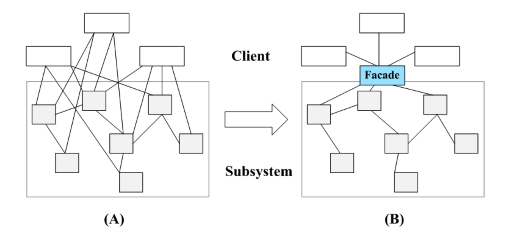

# 外观模式

外观模式：通过引入一个外观角色来简化客户端与子系统之间的交互，为复杂的子系统调用提供一个统一的入口，降低子系统与客户端的耦合度，且客户端调用非常方便。

外观模式是一种使用频率非常高的结构型设计模式。

外观模式的本质：通过对象的封装，减小客户端使用复杂度。

外观模式中的角色：Facade和SubSystem。图（A）为未引入门面模式的情况；图（B）为引入Facade之后的情况。

**Facade模式结构代码**

`SubSystem`

```java
public class SubSystemA  
{  
    public void methodA()  
    {  
        //业务实现代码  
    }  
}  

public class SubSystemB  
{  
    public void methodB()  
    {  
        //业务实现代码  
     }  
}  

public class SubSystemC  
{  
    public void methodC()  
    {  
        //业务实现代码  
    }  
}
```

`Facade`：维持对子系统的引用

```java
public class Facade  
{  
    private SubSystemA obj1 = new SubSystemA();  
    private SubSystemB obj2 = new SubSystemB();  
    private SubSystemC obj3 = new SubSystemC();  

    public void method()  
    {  
        obj1.methodA();  
        obj2.methodB();  
        obj3.methodC();  
    }  
}
```

`Client`：通过外观类来间接调用子系统对象的方法，无需与子系统直接交互

```java
public class Client  
{  
    public static void main(string[] args)  
    {  
        Facade facade = new Facade();  
        facade.Method();  
    }  
}
```

可以看出，门面模式是非常容易理解的。

但假如现在需要增加一个子系统SubSystemD（或者删除一个已存在的子系统SubSystemC），就要修改Facade类，违背了开闭原则。可以通过引入抽象外观类来对系统进行改进，在一定程度上可以解决该问题。在引入抽象外观类之后，客户端可以针对抽象外观类进行编程，对于新的业务需求，不需要修改原有外观类，而对应增加一个新的具体外观类，由新的具体外观类来关联新的子系统对象，同时通过【配置文件+ 反射】的方式来达到不修改任何源代码并更换外观类的目的。

## 参考

[外观模式-Facade Pattern](https://gof.quanke.name/外观模式-Facade%20Pattern.html)：文字+代码均来源于这里

