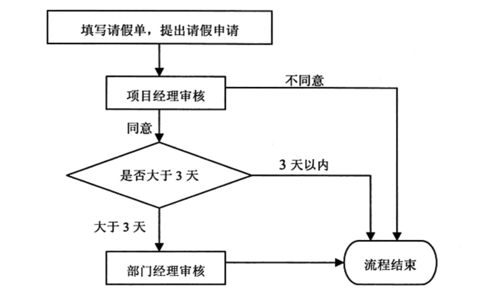

# 状态模式思考

另外一个状态模式应用的场景是工作流（比如请假，你需要先申请，然后团队小组长审核，部门领导审核，xxx审核）。

下面，使用状态模式来实现以下需求：



Context

为了让代码更具通用性（比如，在其他流程如报销中，也可以重复使用一部分代码），引入StateMachine（其实就是Context的更上一层的抽象）

```java
//通用的Contex
public class StateMachine {

    //持有的状态对象
    private State state;

    //处理状态过程中需要的业务数据
    private Object businessVO;

    public void process(){
        state.process(this);
    }

    ...省略state和businessVO的getter和setter方法

}

//请假流程中使用的Context
public class LeaveRequestContext extends StateMachine {

}
```

State：同样引入了更上一层的接口

```java
//通用的State
public interface State{

    void process(StateMachine context);
}
//请假流程中使用的State
public interface LeaveRequestState extends State {

}
```

ConcreteState：有三个

```java
//项目经理状态
public class ProjectManagerState implements LeaveRequestState {

    @Override
    public void process(StateMachine request) {

        LeaveRequestModel model = (LeaveRequestModel) request.getBusinessVO();

        //模拟审批过程
        mockAudit(model);

        if("同意".equals(model.getResult())){
            if(model.getLeaveDays() < 3){
                request.setState(new AuditOverState());
            }else {        
                request.setState(new DepManagerState());
            }
        }else {   
            request.setState(new AuditOverState());
        }    
    }

    private void mockAudit(LeaveRequestModel model) {
        boolean res =  new Random().nextBoolean(); 
        if(res){
            model.setResult("同意");
        }else {
            model.setResult("不同意");
        }
    }
}

//部门经理状态
public class DepManagerState implements LeaveRequestState {

    @Override
    public void process(StateMachine request) {

        LeaveRequestModel model = (LeaveRequestModel) request.getBusinessVO();

        //模拟审批过程
        mockAudit(model);

        //将流程状态设置为结束
        request.setState(new AuditOverState());


    }

    private void mockAudit(LeaveRequestModel model) {
        boolean res =  new Random().nextBoolean(); 
        if(res){
            model.setResult("同意");
        }else {
            model.setResult("不同意");
        }
    }
}
//审批结束状态
public class AuditOverState implements LeaveRequestState {
    @Override
    public void process(StateMachine stateMachine) {
        LeaveRequestModel model = (LeaveRequestModel)stateMachine.getBusinessVO();
        System.out.println("请假审批结束，审批结果：" + model.getResult());
    }
}
```

业务数据

```java
public class LeaveRequestModel {

    //请假人
    private String user;
    //请假开始时间
    private String beginDate;
    //请假天数
    private int leaveDays;
    //请假结果
    private String result;

    ....省略以上属性的getter和setter方法


}
```

客户端：就是构建一个状态机，然后让状态机开始工作

```java
StateMachine context = new LeaveRequestContext();
context.setBusinessVO(model);
context.setState(new ProjectManagerState());
context.process();
```

在上面的示例中，客户端调用时，就是为了创建一个状态机，来对某一次流程进行处理，而构建状态机中需要的业务数据和状态机的当前状态，即business和state，这两个参数是需要保存在某个地方的，一般是数据库。

当然，也可以像上个投票的例子一样，将这些数据保存在Context中（这样仅仅是示例，实际应用中一般是持久化存储的）。

无论是投票的例子，还是工作流的例子：某个对象，对不同状态下，同一方法声明在不同的实现不同，这些不同的逻辑分开放在不同的状态类中，而不是用if-else全部写在同一方法中，因为实际场景下，某一个状态下，业务逻辑可能就很复杂。

对象的状态一般需要持久化到数据库中，而状态改变后，何时去进行下个状态的操作，取决于具体的场景：①有可能是定时去数据库获取特定状态的业务数据；②也有可能是等待用户去获取某特定状态的业务数据；

## **状态模式总结**

状态模式将一个对象在不同状态下的不同行为封装在一个个状态类中，通过设置不同的状态对象可以让环境对象拥有不同的行为，而状态转换的细节对于客户端而言是透明的，方便了客户端的使用。在实际开发中，状态模式具有较高的使用频率，在工作流和游戏开发中状态模式都得到了广泛的应用，例如公文状态的转换、游戏中角色的升级等。

**主要优点**

* 封装了状态的转换规则，在状态模式中可以将状态的转换代码封装在环境类或者具体状态类中，可以对状态转换代码进行集中管理，而不是分散在一个个业务方法中。
* 将所有与某个状态有关的行为放到一个类中，只需要注入一个不同的状态对象即可使环境对象拥有不同的行为。
* 允许状态转换逻辑与状态对象合成一体，而不是提供一个巨大的条件语句块，状态模式可以让我们避免使用庞大的条件语句来将业务方法和状态转换代码交织在一起。
* 可以让多个环境对象共享一个状态对象，从而减少系统中对象的个数。

**主要缺点**

* 状态模式的使用必然会增加系统中类和对象的个数，导致系统运行开销增大。
* 状态模式的结构与实现都较为复杂，如果使用不当将导致程序结构和代码的混乱，增加系统设计的难度。
* 状态模式对“开闭原则”的支持并不太好，增加新的状态类需要修改那些负责状态转换的源代码，否则无法转换到新增状态；而且修改某个状态类的行为也需修改对应类的源代码。

**适用场景**

* 对象的行为依赖于它的状态（如某些属性值），状态的改变将导致行为的变化。
* 在代码中包含大量与对象状态有关的条件语句，这些条件语句的出现，会导致代码的可维护性和灵活性变差，不能方便地增加和删除状态，并且导致客户类与类库之间的耦合增强。

## 参考

《研磨设计模式 第18章 状态模式》：代码

[状态模式-State Pattern](https://quanke.gitbooks.io/design-pattern-java/content/状态模式-State%20Pattern.html) ：文字

