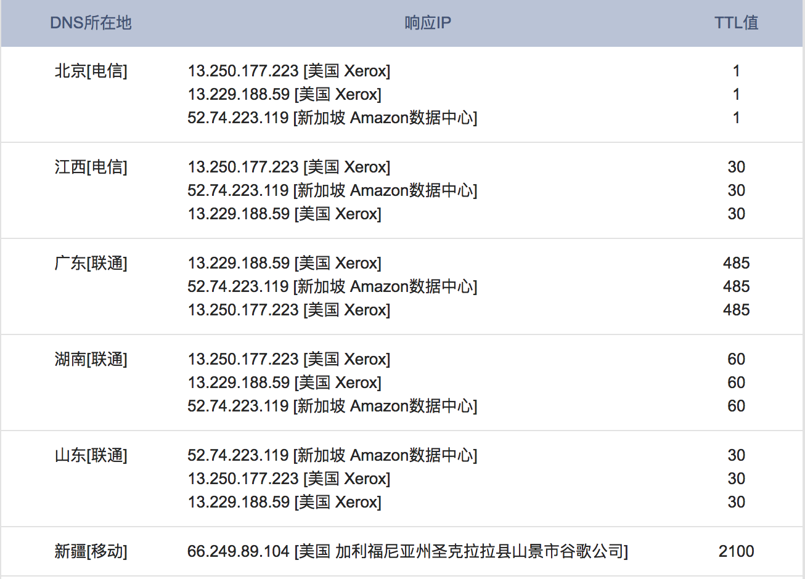

# 互联网架构下的负载均衡

当用户在浏览器输入`http://www.exapmle.com`这种地址进行访问，浏览器首先会查询DNS服务器获取对应的IP，然后通过此IP访问对应的服务。

很容易想到的一种方式是`www.exapmle.com`域名映射多个`IP`，但是，存在一个最简单的问题，假设某台服务器重启或者出现故障，DNS会有一定的缓存时间，故障后切换时间长，而且没有对后端服务进行心跳检查和失败重试的机制。

因此，外网DNS应该用来实现用GSLB（全局负载均衡）进行流量调度，如将用户分配到离他最近的服务器上以提升体验。而且当某一区域的机房出现问题时（如被挖断了光缆），可以通过DNS指向其他区域的IP来使服务可用。

例如，我们使用站长之家提供的[DNS查询](http://tool.chinaz.com/dns/?type=1&host=www.github.com&ip=)服务，查询`www.github.com`，可以看到类似如下的结果。

即不同的运营商返回的公网IP是不一样的（且同一运营商也可能设置多个IP）。

对于内网DNS，可以实现简单的轮询负载均衡。但是，还是那句话，会有一定的缓存时间并且没有失败重试机制。因此，我们可以考虑选择如HaProxy和Nginx。

当请求到达内网后，一般会再LVS/F5四层负载均衡 + Nginx七层负载均衡就可以到达真实的应用服务器，如下图所示：

引入四层负载均衡的原因是：Nginx一般用于七层负载均衡，其吞吐量是有一定限制的。为了提升整体吞吐量，会在DNS和Nginx之间引入四层负载均衡（接入层）：LVS（软件负载均衡器）或者F5（硬负载均衡器）。

**即对一个请求而言，从浏览器到后端真实应用服务器，一般会经过：①DNS解析到LVS/F5；②LVS/F5转发给Nginx；③Nginx转发给后端真实应用服务器。**

对于一般业务开发人员来说，只需要关心到层面就够了，接入层的LVS/F5负载均衡一般由系统/运维工程师来维护。

## 内容来源

《亿级流量网站架构核心技术》：负载均衡与反向代理：略有改动

